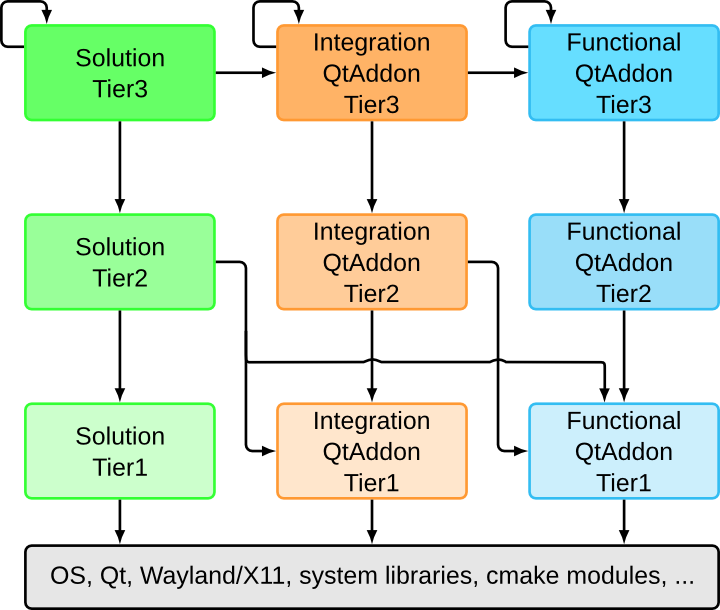

# Frameworks 5

KDE Frameworks 5 are a set of cross platform solutions that extend the functionality Qt offers. They are designed as drop-in Qt Addon libraries, enrich Qt as a development environment with functions that simplify, accelerate and reduce the cost of Qt development. Frameworks eliminate the need to reinvent key functionalities.

All frameworks come with quality promises, are developed in an open and welcoming environment, and are licensed under the Lesser Gnu Public License. By having each framework tailored to a specific use case, a framework can bring you the feature you need with a minimum of additional libraries.

Frameworks 5 consists of functional components and are structured in 'tiers' and 'categories'. The tiers give a structure for link-time dependencies. Tier 1 Frameworks can be used independently, while Tier 3 Frameworks can depend on other Tier 3 Frameworks and tiers below them. The catagories give information about the run-time dependencies, and are divided into the following three catagories:

* **Functional** frameworks have no runtime dependencies. For example, KArchive handles compression and decompression for many archive formats transparently and can be used as a drop-in library.
* **Integration** designates code that requires runtime dependencies for integration depending on what the OS or platform offers. For example, Solid supplies information on available hardware features and may require runtime components to deliver some of the data on some platforms.
* **Solutions** have mandatory runtime dependencies. For example, KIO (KDE Input/Output) offers a network-transparent virtual filesystem that lets users browse and edit files as if they were local, no matter where they are physically stored. And KIO requires kioslave daemons to function.

The Frameworks are also separated by respecting core/gui distinctions and the different GUI technologies. So it is not uncommon to find a core, a gui and a widget module relating to a given Framework (e.g KConfigCore vs KConfigGui). This way third parties can use only the parts they need and avoid pulling unwanted dependencies on QtGui.

## History
For over 15 years, the KDE libraries formed the common code base for (almost) all KDE applications. They provided a high-level functionality such as toolbars and menus, spell checking and file access. In that time 'kdelibs' was released and distributed as a single set of interconnected libraries. Through the KDE Frameworks efforts, these libraries have been methodically reworked into a set of independent, cross platform classes that now are available to all Qt developers.

The journey started at the Randa Meetings back in 2011, where porting KDE Platform 4 to Qt 5 was initiated. But as part of this effort, modularizing of libraries, integrating portions properly into Qt 5 and modularizing was begun. Three years later, Frameworks 5 was released. Today you can save yourself the time and effort of repeating work that others have done, relying on over 50 Frameworks with mature, well tested code.

