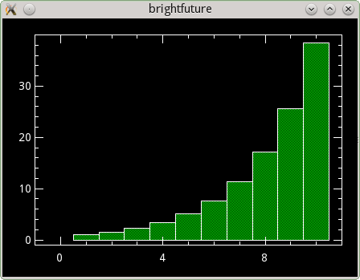
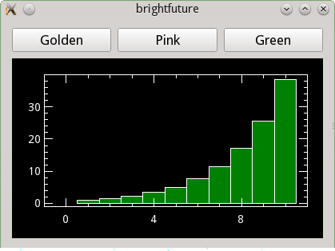
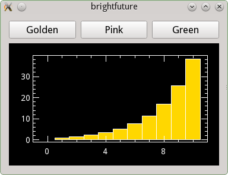

# Creating a new application

You have an awesome idea. The idea which will change the world, which will
bring everybody a bright future. This idea needs to be implemented *now*, so you sit down and do it. Your toolkit of choice is Qt, what else?

There are many ways to start a new Qt application. One of them is using the tool `kapptemplate`, which generates a fresh skeleton of an application you
can then fill with all the goodness your idea brings.

## Starting a new application from a template

So you run `kapptemplate` and start the wizard. First you have to choose which template to use. We use the "Minimal C++ KDE Frameworks" one. This will get us started and open up a bunch of nice opportunities coming from KDE Frameworks. More about that later.


We enter the name of our new application "BrightFuture" and continue the wizard.

Now we just need to enter some basic data about the application, the initial
version number, author, and where the code should be stored. This will
usually already be neatly pre-filled.


Now continue and finish the wizard and you have the initial code ready for your new application.

Before you compile the code, we highly recommend to first create a build folder that will be separated from your source folder. That's because when you start compiling the application, the build system will create lots of files during the compilation and the folder with your source code could quickly become overpopulated with files. This way you'll have a clean separation between source code and the compiled binary files.

Go to the code folder, create a "build" folder and cd into it

```
mkdir build
cd build
```

Now compile it with

```
cmake ..
make
```

Run it with

```
src/brightfuture
```

and there you are. Greetings from KDE to your new application.


## Walking through the skeleton

Let's have a look at what was generated there and walk through the initial code.

### main.cpp

The starting point is [main.cpp](brightfuture/src/main.cpp). That's where the
application is set up. The first line of the main function creates an
application object:

@@snippet(brightfuture/src/main.cpp, application, cpp)

This is straightforward, but there is one important thing to notice, especially if you have not seen KDE applications before. We use a `QApplication`; that's with a `Q` not a `K`. So no special setup is needed anymore for writing applications with KDE Frameworks. It's just a Qt application, and you can later add whatever you need whenever you want.

The scope of your idea of course doesn't stop at language barriers, so the
template conveniently sets up internationalization of the texts in your
application under a dedicated translation domain:

@@snippet(brightfuture/src/main.cpp, i18n, cpp)

The next step is to set up some basic information about the application, so that this can be shown to users and wherever else this is useful:

@@snippet(brightfuture/src/main.cpp, about, cpp)

This makes use of the data you entered in the wizard before. Note that it uses the `i18n` function to translate all strings visible to users. This comes from the KDE Framework `k18n`.

The `KAboutData` class comes from the KDE Framework `kcoreaddons`.

As the next step, the command line is parsed, so users can get help about the
use of the program from the command line, information about author and
version and whatever options BrightFuture will need:

@@snippet(brightfuture/src/main.cpp, commandline, cpp)

Finally we show the application's main window and give control to the user:

@@snippet(brightfuture/src/main.cpp, mainwindow, cpp)

### BrightFuture

The main window is implemented in the class `BrightFuture`. Let's have a look.

The header [brightfuture.h](brightfuture/src/brightfuture.h) is minimal:

@@snippet(brightfuture/src/brightfuture.h, BrightFuture, cpp)

It defines a window inherited from `QMainWindow` and adds a main widget
`Ui::mainWidget m_ui;`, which is defined in the Qt Designer file
[brightfuture.ui](brightfuture/src/brightfuture.ui).

The implementation [brightfuture.cpp](brightfuture/src/brightfuture.cpp) brings the application to life in its constructor:

@@snippet(brightfuture/src/brightfuture.cpp, constructor, cpp)

This is standard Qt code. We will add a little bit more here later.


## Plotting the future

We know the future is bright, so let our application plot it. KDE Frameworks
comes with the framework `KPlotting`, which is able to do simple plots. See the
[KPlotting API](https://api.kde.org/frameworks/kplotting/html/index.html)
for more information. We will use it to plot a set of data points in our main
window.

To make use of the framework, declare that you are using it in your
main [CMakeLists.txt](brightfuture2/CmakeLists.txt) file. Simply add `Plotting` to the `find_package` statement for the KDE Frameworks libraries (it uses `KF5` as a shortcut):

```
find_package(KF5 REQUIRED COMPONENTS
    CoreAddons
    I18n
    Plotting
)
```

You also have to link to the library in the
[CMakeLists.txt](brighfuture2/CMakeLists.txt) file in the `src` directory where the source files of the application are defined, and how they are linked to the required libraries. Add `KF5::Plotting` to the `target_link_libraries` statement there:

```
target_link_libraries( brightfuture
    Qt5::Widgets
    KF5::CoreAddons
    KF5::I18n
    KF5::Plotting
)
```

Now we can write the actual code to plot the future. We add that to the
constructor of the main window and replace the code, which was generated by the template generator there:

@@snippet(brightfuture2/src/brightfuture.cpp, constructor, cpp)

That's all. Here is the plot of the future:




## Configuring the color

The future is bright, but everybody has a different preference for its color. So
let's make the color of the future configurable.

KDE Frameworks offers `KConfig`, which is a framework for reading and writing
configuration data. We will make use of it in our application to save the color
of the plot we created in the previous section.

### Enabling KConfig

As the first we need to add the framework to the main
[CMakeList.txt](brightfuture3/CmakeList.txt), so that includes and libraries
become available:

@@snippet(brightfuture3/CMakeLists.txt, config, cmake)

Then we need to link to the `ConfigGui` library in the
[CmakeList.txt](brightfuture3/src/CmakeList.txt) file in the `src` directory to
be able to access the functions `KConfig` provides:

@@snippet(brightfuture3/src/CMakeLists.txt, config, cmake)

`KConfig` provides two libraries: `KConfigCore` and `KConfigGui`. The core
library contains the basic functionality. The GUI library adds support for
data type used in GUIs. We want to store a color, which is a GUI type, that is
why we link to `KConfigGui`.

### Adding the capability to plot in different colors

To be able to make the color configurable, `brightfuture` first needs to be able
to plot in different colors. We simply do that by adding three buttons, which
each call a separate slot setting the colors to green, golden, or pink.



This code is straight-forward Qt code. It is in
[brightfuture.h](brightfuture3/src/brightfuture.h) and
[brightfuture.cpp](brightfuture3/src/brightfuture.cpp). Have a look there to
see the details. We will focus on the configuration code now.

### Writing the configuration

We need to classes for dealing with configuration data, `KSharedConfig` and
`KConfigGroup`, so we add the include statements for them at the top of the
[brightfuture.cpp](brightfuture3/src/brightfuture.cpp) file:

@@snippet(brightfuture3/src/brightfuture.cpp, include, cpp)

`KSharedConfig` represents a configuration. It is the main class, which provides
access to configuration groups and takes care of storing, reading, and writing
configuration data.

`KConfigGroup` represents a named configuration group. This is the object you
need to actually read and write configuration data. It takes a name, which is
used to group the configuration in the configuration files.

Now that we have the classes available, we just need to make use of them:

@@snippet(brightfuture3/src/brightfuture.cpp, write, cpp)

This is the function which is called when pressing one of the color buttons.
It sets the color and then calls the function doing the actual plot. The
magic happens in the first two lines of the function.

The first line creates the `KConfigGroup` object, which is used to write the
configuration. It uses the application-wide shared configuration object, which
is retrieved by the `KSharedConfig::openConfig()` call. The second parameter
is the name of the group, where the configuration should be stored.

The second line writes the configuration value we want to store. We simply call
`writeEntry` on the group object, give it a name of our choice for the
configuration option, and pass the color as the object to store. `KConfig` does
the magic to figure out how to deal with a `QColor` object in the configuration
file behind the scenes.

By default configuration is stored in a INI-style text file in the directory
`~/.config/brightfuturerc`:

```
[colors]
plot=255,215,0
```

The name of the configuration file is derived from the application name defined
by `KAboutData` in the [main.cpp](brightfuture3/src/main.cpp) file:

@@snippet(brightfuture3/src/main.cpp, about, cpp)

### Reading the configuration

Now the final step is to read the configuration on startup of the application,
so that the choice of the user is remembered.

This is done in the `plotFuture` function:

@@snippet(brightfuture3/src/brightfuture.cpp, read, cpp)

We get the "color" group from the configuration object for the application
again and then call `readEntry` to read the value we wrote before. The second
parameter `QColor("green")` is the default value which is used when no
value can be found in the configuration file.

We can now start the application, click the "golden" button to change the color
of the plot to gold, and the next time we start the application the plot is
rendered golden at once.



That's all we need. We have made the color of the future configurable and made
it golden.
