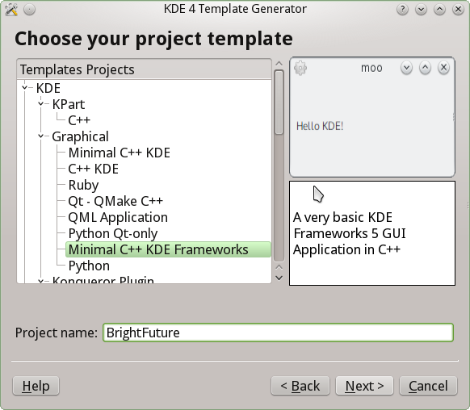
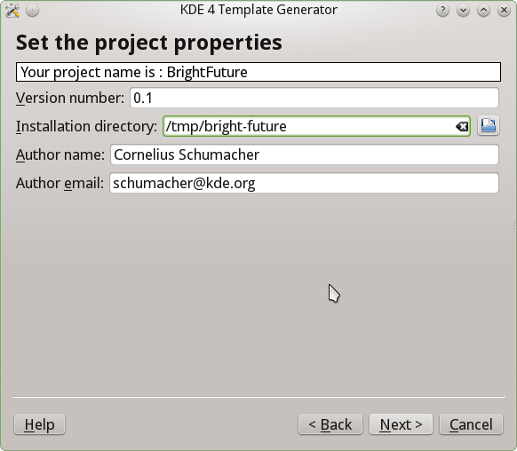

# Creating a new application

You have this awesome idea. The idea, which will change the world, which will
bring everybody a bright future. You feel that this idea needs to be
implemented, so you sit down and do it. Your toolkit of choice is Qt, what
else.

There are many ways to start a new Qt application. One of them is using the tool
`kapptemplate`, which generates you a nice fresh skeleton of an application you
can then fill with all the goodness your idea brings.

## Starting a new application from a template

So you run `kapptemplate` and start the wizard. First you have to choose which
template to use. We use the "Minimal C++ KDE Frameworks" one. This will get us
started and open up a bunch of nice opportunities coming from KDE Frameworks.
More about that later.



We enter the name of our new application "BrightFuture" and continue the wizard.

Now we just need to enter some basic data about the application, the initial
version number, who the author is, where the code should be stored. This will
usually alredy be neatly pre-filled.



Now continue and finish the wizard and you have the initial code ready for your
new application.

Go to the code and compile it with

```
cmake .
make
```

Run it with

```
src/brightfuture
```

and there you go. Greetings from KDE to your new application.

## Walking through the skeleton

Let's have a look at what was generated there and walk through the initial code.

### main.cpp

The starting point is [main.cpp](brightfuture/src/main.cpp). That's where the
application is set up. The first line of the main function creates an
application object:

@@snippet(brightfuture/src/main.cpp, application, cpp)

This is straightforward, but there is one important thing to notice, especially
if you have seen KDE applications before. We use a `QApplication`, that's with
a `Q`, not a `K`. That means there is no special setup needed anymore for
writing applications with KDE Frameworks. It's just a Qt application, and you
can add whatever you need whenevery you want at a later point in time.

The scope of your idea of course doesn't stop at language barriers, so the
template conveniently sets up internationalization of the texts of your
application under a dedicated translation domain:

@@snippet(brightfuture/src/main.cpp, i18n, cpp)

The next step is to setup some basic information about the application, so that
this can be shown to users and wherever else this is useful:

@@snippet(brightfuture/src/main.cpp, about, cpp)

This makes use of the data you entered in the wizard before. Note that it uses
the `i18n` function to translate all strings visible to users. This comes from
the KDE Framework `k18n`.

The `KAboutData` class comes from the KDE Framework `kcoreaddons`.

As the next step the command line is parsed, so users can get help about the
usage of the program from the command line, information about author and
version and whatever options BrightFuture will need:

@@snippet(brightfuture/src/main.cpp, commandline, cpp)

Finally we show the application's main window and give control to the user:

@@snippet(brightfuture/src/main.cpp, mainwindow, cpp)

### BrightFuture

The main window is implemented in the class `BrightFuture`. Let's have a look
at what's happening there.

The header [brightfuture.h](brightfuture/src/brightfuture.h) is pretty minimal:

@@snippet(brightfuture/src/brightfuture.h, BrightFuture, cpp)

It defines a window inherited from `QMainWindow` and adds a main widget
`Ui::mainWidget m_ui;`, which is defined in the Qt Designer file
[brightfuture.ui](brightfuture/src/brightfuture.ui).

The implementation [brightfuture.cpp](brightfuture/src/brightfuture.cpp) brings
the application to life in its constructor:

@@snippet(brightfuture/src/brightfuture.cpp, constructor, cpp)

This is standard Qt code. You know that. We will add a little bit more here
later.
